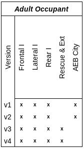
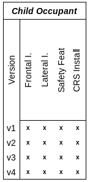
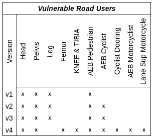
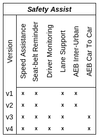
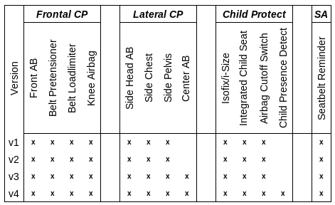
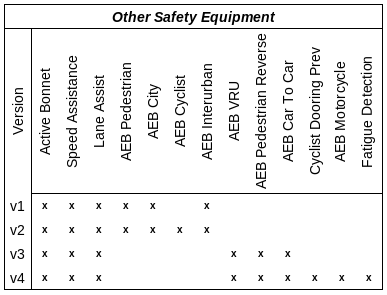

# Euro NCAP data mining project

# Versioning
Euro NCAP has protocols for each year with a protocol ID. In some years with release of a new protocol they make critical changes for data side and scraping side. 

It it hard to process data with these significant changes. Also comparing one to another is painful. To remedy that i've developed a **versioning system** for protocols.

- **v1**
  - 24370, Year: 2016
  - 26061, Year: 2017
- **v2**
  - 30636, Year: 2018
  - 34803, Year: 2019
- **v3**
  - 40302, Year: 2020
  - 41776, Year: 2021
  - 45155, Year: 2022
- **v4**
  - 49446, Year: 2023

> [!IMPORTANT]
> There is some minor changes between versions that effects field points.
> To issue this all fields divided by their cap. For example if a car got **2 / 4 Pts** from some test it is converted to **0.5**
> These tables shows only field changes.

> The differences between protocols listed below

 